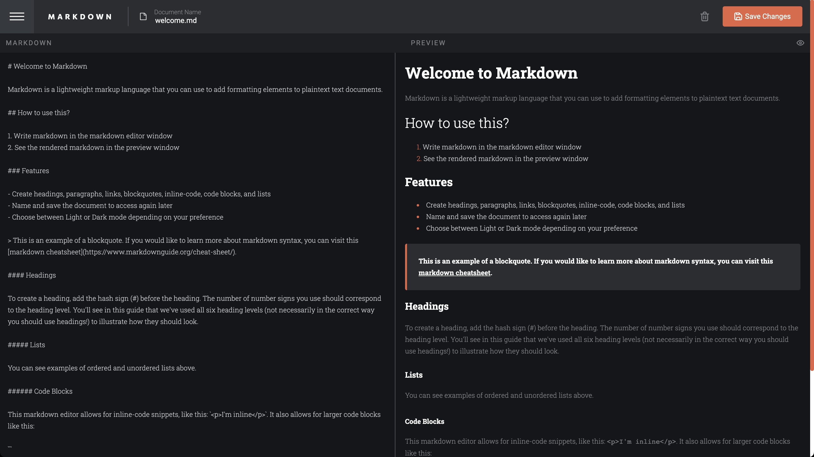
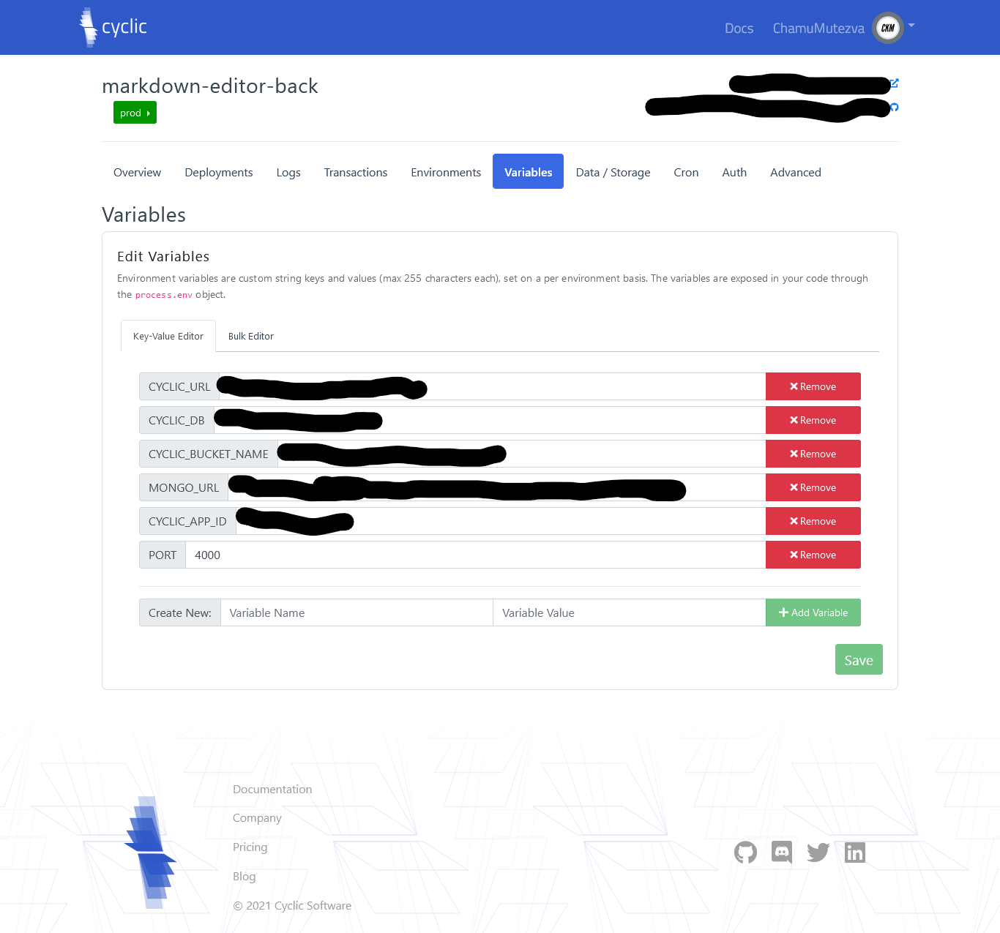

# Frontend Mentor - In-browser markdown editor solution

This is a solution to the [In-browser markdown editor challenge on Frontend Mentor](https://www.frontendmentor.io/challenges/inbrowser-markdown-editor-r16TrrQX9). Frontend Mentor challenges help you improve your coding skills by building realistic projects. 

## Table of contents

- [Overview](#overview)
  - [The challenge](#the-challenge)
  - [Screenshot](#screenshot)
  - [Links](#links)
- [My process](#my-process)
  - [Built with](#built-with)
  - [What I learned](#what-i-learned)
  - [Continued development](#continued-development)
  - [Useful resources](#useful-resources)
- [Author](#author)
- [Acknowledgments](#acknowledgments)

## Overview

### The challenge

Users should be able to:

- Create, Read, Update, and Delete markdown documents
- Name and save documents to be accessed as needed
- Edit the markdown of a document and see the formatted preview of the content
- View a full-page preview of the formatted content
- View the optimal layout for the app depending on their device's screen size
- See hover states for all interactive elements on the page
- **Bonus**: If you're building a purely front-end project, use localStorage to save the current state in the browser that persists when the browser is refreshed
- **Bonus**: Build this project as a full-stack application

### Screenshot




### Links

- Solution URL: [Add solution URL here](https://your-solution-url.com)
- Live Site URL: [Markdown Editor](https://markdown-editor-ckm.netlify.app/)
- link live site [aws link](https://dev.d3f1qjpgfbf286.amplifyapp.com/) 

## My process

### Built with

- Semantic HTML5 markup
- CSS custom properties
- Flexbox
- CSS Grid
- Mobile-first workflow
- [React](https://reactjs.org/) - JS library
- [React-showdown](https://openbase.com/js/react-showdown/documentation) - HTML markup convertor
- [AWS amplify](https://docs.amplify.aws/)- hosting and authentication

### What I learned

**react-showdown** is a tool that converts markdown to html . The installation and usage process is as follows:
- install using `npm` or `yarn` . That is `npm install --save react-showdown` with npm or the yarn equivalence `yarn add react-showdown`
- import it in your project file with `import MarkdownView from 'react-showdown';`

```tsx
 const markdown = `
# Welcome to React Showdown :+1:

To get started, edit the markdown in \`example/src/App.tsx\`.

| Column 1 | Column 2 |
|----------|----------|
| A1       | B1       |
| A2       | B2       |
`;

  return (
    <MarkdownView
      markdown={markdown}
      options={{ tables: true, emoji: true }}
    />
  );
};
```

**AWS Amplify**
- amplify allows hosting on the AWS platform and a lot more other additionals, such as authentication and database management.
- several tutorials can be found on their website including the following [AWS amplify](https://docs.amplify.aws/)

**CYCLIC - connecting database , backend and frontend**
- Heroku was a popular site hosting/deploying such applications. The service was free on Heroku until 28/11/2022. After a few search for a replacement , i settled for [CYCLIC](https://docs.cyclic.sh/). Procedure followed is shown below
1. Open a free account on Cyclic using the link above. You can open the account using your Github account if you have one
2. Open your Cyclic dashboard to proceed and look for an option to `Create an app`
3. The next page gives you an option to `Link your project` or to select from `Starter Templates` . Select the `Link your project` option and any other option that allows you to view the projects in your GitHub account. You will be able to view all the projects in your account.
4. For a Fullstack Application, select the repository that has your backend configurations. Accept any other options and choose the branch to deploy. 
5. The deploy does not take long and will be done in less than a minute. A link will be generated that will connect the backend to the mongoDB. Test the link if it will give you the results in your mongoDb.
6. Importantly you need to update the Environment Variables of your project 
7. In the frontend project , use the link generated in your Cyclic as the end point. See code below
```
export const API_ENDPOINT_PATH = process.env.NODE_ENV === 'production'
    ? "https://lime-smoggy-camel.cyclic.app/"
    : "http://localhost:4000/api/editor"
```
First we check the value of `process.env.NODE_ENV` if it is equal to `production` , it true then the `https://lime-smoggy-camel.cyclic.app/` will be assigned to the endpoint else we are in development mode hence the locahost value will be used.
See and listen to the video [How to deploy MERN App in 2 minutes | cyclic.sh | Heroku alternative](https://www.youtube.com/watch?v=IxdiZcxgsyc)


### Continued development

### Useful resources
- [aws react tutorial setting](https://docs.amplify.aws/start/q/integration/react/) - a step by step guide for setting up AWS hosting using amplify

## Author

- Website - [Add your name here](https://www.your-site.com)
- Frontend Mentor - [@yourusername](https://www.frontendmentor.io/profile/yourusername)
- Twitter - [@yourusername](https://www.twitter.com/yourusername)

## Acknowledgments

